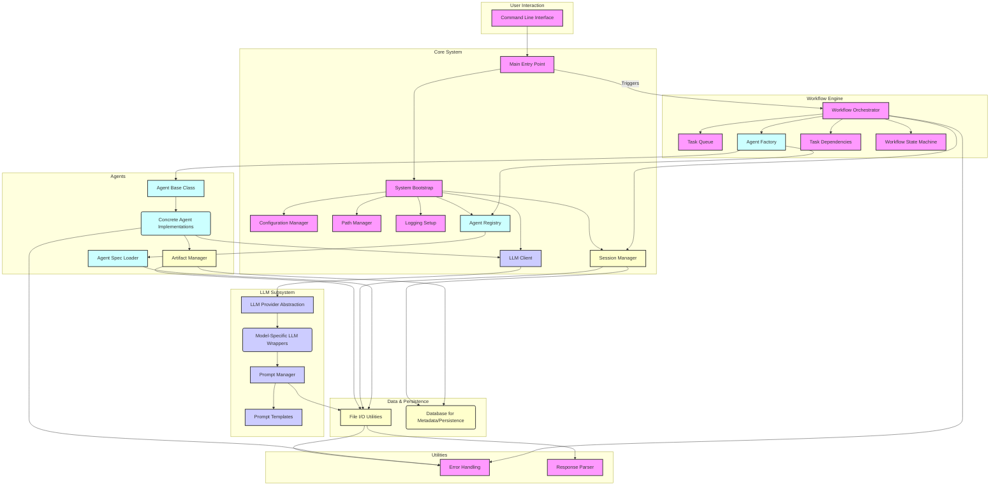

# Architecture Overview of the Agent Framework

The Agent Framework is designed as a modular, extensible system to orchestrate AI agents for complex software engineering tasks. Its architecture emphasizes clear separation of concerns, pluggable components, and a robust workflow engine.

## Core Principles

-   **Modularity:** Components are designed to be independent and interchangeable.
-   **Configuration-Driven:** Behavior is largely dictated by external configuration, allowing flexibility.
-   **Abstraction:** Interfaces are used to abstract away implementation details (e.g., LLM providers).
-   **State Management:** Explicit tracking of session and workflow states.
-   **Dependency Awareness:** Workflows respect task dependencies to ensure correct execution order.

## High-Level Component Diagram

## Component Breakdown and Interaction Flow

### 1. **Initialization and Configuration (`config.py`, `paths.py`, `logger.py`, `bootstrap.py`)**

-   **`config.py`**: Handles loading application settings from `.env` files or environment variables into Pydantic `Settings` models. Provides strongly typed and validated configuration throughout the application.
-   **`paths.py`**: Offers utility functions (`get_root_dir`, `ensure_dir`) for managing file system paths, ensuring consistent directory structures for logs, artifacts, and prompts.
-   **`logger.py`**: Sets up the application's logging infrastructure, supporting various log levels, console output (with colors), and file output (standard text and JSON formats).
-   **`bootstrap.py`**: The central initialization routine that orchestrates the startup sequence:
    1.  Loads configuration.
    2.  Sets up path management.
    3.  Initializes logging.
    4.  Initializes LLM clients.
    5.  Loads agent specifications into the `AgentRegistry`.
    6.  Starts a new `Session`.

### 2. **Core Data Structures (`models.py`)**

-   **`models.py`**: Defines all fundamental data models using Pydantic, ensuring data integrity and validation. Key models include:
    -   `AgentSpec`: Definition of an agent (name, role, description).
    -   `TaskSpec`: Details of a task to be executed (ID, name, description, agent, dependencies, input data).
    -   `Artifact`: Metadata for any output produced by an agent (name, type, data reference).
    -   `Session`: Represents a single execution run (ID, start/end time, status, logs, artifacts).
    -   `ExecutionContext`: Runtime context for an execution (session ID, environment variables, flags).
    -   `AgentResponse`: Standardized structure for agent outputs (status, output data, artifacts).

### 3. **LLM Subsystem (`llms/`, `prompt_manager.py`, `prompt_templates.py`)**

-   **`llms/provider.py`**: Defines the abstract `LLMProvider` interface (`generate(prompt)`), enabling any LLM to be integrated.
-   **`llms/*.py`**: Concrete implementations of `LLMProvider` for various LLMs (e.g., `gemini.py`, `ollama.py`, `kimi.py`, `mistral.py`).
-   **`llms/client.py`**: Manages the instantiation and lifecycle of LLM providers, loading API keys and endpoints from configuration.
-   **`prompt_manager.py`**: Loads and manages prompt templates from a dedicated directory, allowing agents to retrieve prompts by name.
-   **`prompt_templates.py`**: Provides utilities for loading and rendering Jinja2-based prompt templates.

### 4. **Agent Management (`agents/`)**

-   **`agents/base.py`**: Defines the abstract `Agent` class with a `run(task: TaskSpec) -> AgentResponse` method that all concrete agents must implement.
-   **`agents/registry.py`**: A central registry for `AgentSpec` models and concrete `Agent` classes, enabling lookup by name or role. Loads `AgentSpec` from YAML/JSON files.
-   **`agents/factory.py`**: A factory class responsible for instantiating concrete `Agent` objects based on `AgentSpec`s retrieved from the `AgentRegistry`.

### 5. **Workflow Orchestration (`task_manager.py`, `task_dependencies.py`, `workflow/`, `orchestrator.py`)**

-   **`task_manager.py`**: Manages the `TaskQueue`, handling adding tasks, retrieving the next task for execution, and updating task statuses.
-   **`task_dependencies.py`**: Provides algorithms for `topological_sort` and `detect_cycles` to manage inter-task dependencies and prevent infinite loops.
-   **`workflow/state.py`**: Implements a `WorkflowStateMachine` to track the overall state of a workflow (INIT, RUNNING, COMPLETED, FAILED).
-   **`workflow/planner.py`**: Generates and validates execution plans for workflows, utilizing task dependency management.
-   **`orchestrator.py`**: The core of the workflow engine. It:
    1.  Receives an initial list of tasks.
    2.  Validates and topologically sorts these tasks using `WorkflowPlanner`.
    3.  Populates the `TaskQueue`.
    4.  Iteratively fetches tasks, dispatches them to appropriate agents (via `AgentFactory`), and processes their `AgentResponse`.
    5.  Manages workflow state transitions and logs all activities.

### 6. **Persistence & Data Handling (`artifacts.py`, `session_manager.py`, `database/`)**

-   **`artifacts.py`**: Manages the storage, retrieval, and versioning of artifacts produced by agents. Interacts with `file_io.py`.
-   **`session_manager.py`**: Tracks individual workflow runs (sessions), persisting logs and artifacts, and managing their lifecycle in coordination with the `WorkflowStateMachine`.
-   **`database/schema.sql`**: Defines the SQL schema for persisting core metadata (sessions, artifacts, agent specifications) in a relational database (e.g., PostgreSQL).
-   **`database/migration.sql`**: Script for applying schema changes to the database.

### 7. **Utility & Cross-Cutting Concerns (`error_handling.py`, `response_parser.py`)**

-   **`error_handling.py`**: Provides decorators for robust error handling, including logging exceptions and implementing retry policies for unreliable operations.
-   **`response_parser.py`**: Utility for parsing agent or LLM responses, intelligently detecting and deserializing JSON or falling back to plain text.

### 8. **Application Entry Point (`main.py`, `cli.py`)**

-   **`cli.py`**: Defines the command-line interface using `argparse`, exposing subcommands like `run`, `init`, and `status`.
-   **`main.py`**: The application's entry point. It calls `bootstrap_system` to initialize the framework and then delegates to `cli.py` to handle user commands.

This architecture ensures a clear flow of control and data, making the system maintainable, scalable, and adaptable to various agent-based automation scenarios.
